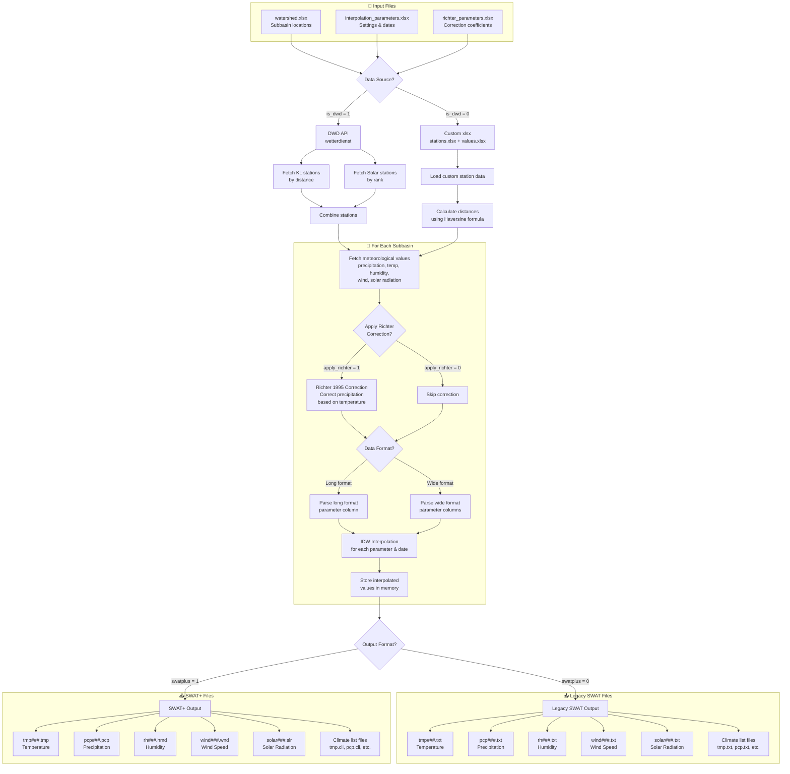

# meteo-interp

Meteorological data interpolation tool for SWAT/SWAT+ hydrological models. Fetches weather data from DWD (German Weather Service) or custom sources and interpolates values to watershed subbasin centroids using Inverse Distance Weighting (IDW).

## Features

- **Data Sources**: DWD Open Data API or custom xlsx files
- **Interpolation**: Inverse Distance Weighting (IDW) with configurable power parameter
- **Precipitation Correction**: Optional Richter (1995) correction for systematic precipitation measurement errors
- **Output Formats**: SWAT and SWAT+ climate file formats
- **Parameters**: Temperature (max/min), precipitation, humidity, wind speed, solar radiation

## Workflow



## Installation

```bash
# Clone the repository
git clone https://github.com/4farid/meteo-interp.git
cd meteo-interp

# Install dependencies
pip install pandas numpy openpyxl wetterdienst
```

## Project Structure

```
meteo-interp/
├── main.py                 # Main script
├── src/
│   ├── dwd.py             # DWD data fetching
│   ├── idw.py             # IDW interpolation
│   ├── richter.py         # Richter precipitation correction
│   └── write_swat_output.py  # SWAT/SWAT+ file writers
└── data/
    ├── watershed.xlsx              # Subbasin definitions
    ├── interpolation_parameters.xlsx   # Configuration
    ├── richter_parameters.xlsx     # Richter correction coefficients
    ├── stations.xlsx               # Custom station data (if is_dwd=0)
    ├── values.xlsx                 # Custom weather data (if is_dwd=0)
    ├── interpolated_swat/          # Output: SWAT files
    └── interpolated_swatplus/      # Output: SWAT+ files
```

## Input Files

### watershed.xlsx

Defines the subbasin centroids for interpolation.

| Column | Description |
|--------|-------------|
| Subbasin | Subbasin ID |
| Lat | Latitude (decimal degrees) |
| Long | Longitude (decimal degrees) |
| Elevation | Elevation (m) - optional |

### interpolation_parameters.xlsx

Configuration parameters for the interpolation.

| Column | Description |
|--------|-------------|
| start_date | Start date for data fetching |
| end_date | End date for data fetching |
| radius_kl | Search radius for stations (km) |
| swatplus | Output format: 1 = SWAT+, 0 = SWAT |
| is_dwd | Data source: 1 = DWD API, 0 = custom xlsx |
| apply_richter | Richter correction: 1 = apply, 0 = skip |

### richter_parameters.xlsx

Richter (1995) precipitation correction coefficients.

| Column | Description |
|--------|-------------|
| T_Snow | Temperature threshold for snow (°C) |
| T_Mix | Temperature threshold for mixed precipitation (°C) |
| b_Snow, epsilon_Snow | Snow correction coefficients |
| b_Mix, epsilon_Mix | Mixed precipitation coefficients |
| b_Summer, epsilon_Summer | Summer rain coefficients |
| b_Winter, epsilon_Winter | Winter rain coefficients |
| Summer_month_Start | First month of summer season |
| Winter_month_Start | First month of winter season |
| maximum_changes | Maximum correction factor |

### stations.xlsx (when is_dwd=0)

Custom weather station metadata.

| Column | Description |
|--------|-------------|
| station_id | Unique station identifier |
| latitude | Station latitude |
| longitude | Station longitude |

### values.xlsx (when is_dwd=0)

Custom weather data in wide format.

| Column | Description |
|--------|-------------|
| station_id | Station identifier |
| date | Observation date |
| precipitation_height | Daily precipitation (mm) |
| temperature_air_max_2m | Daily max temperature (°C) |
| temperature_air_min_2m | Daily min temperature (°C) |
| humidity | Relative humidity (%) |
| wind_speed | Wind speed (m/s) |
| radiation_global | Solar radiation (MJ/m²) |

## Usage

```bash
python main.py
```

The script will:
1. Read configuration from xlsx files
2. Fetch weather data (DWD or custom). Solar radiation does not use the distance method; it takes 3 nearest stations
3. Calculate distances from each subbasin to nearby stations
4. Apply IDW interpolation for each parameter
5. Optionally apply Richter precipitation correction
6. Write output files in SWAT or SWAT+ format

## Output Files

### SWAT (swatplus=0)
- `pcp001.txt`, `pcp002.txt`, ... - Precipitation
- `tmp001.txt`, `tmp002.txt`, ... - Temperature (max, min)
- `rh001.txt`, `rh002.txt`, ... - Relative humidity
- `wind001.txt`, `wind002.txt`, ... - Wind speed
- `solar001.txt`, `solar002.txt`, ... - Solar radiation
- `pcp.txt`, `tmp.txt`, etc. - Station list files

### SWAT+ (swatplus=1)
- `pcp001.pcp`, `pcp002.pcp`, ... - Precipitation
- `tmp001.tmp`, `tmp002.tmp`, ... - Temperature
- `hmd001.hmd`, `hmd002.hmd`, ... - Humidity
- `wnd001.wnd`, `wnd002.wnd`, ... - Wind
- `slr001.slr`, `slr002.slr`, ... - Solar radiation
- `*.cli` - Climate list files

## References

- Richter, D. (1995). Ergebnisse methodischer Untersuchungen zur Korrektur des systematischen Meßfehlers des Hellmann-Niederschlagsmessers. Berichte des Deutschen Wetterdienstes 194.
- DWD Open Data: https://opendata.dwd.de/
- Gutzmann, B., & Motl, A. Wetterdienst: Open weather data for humans. https://github.com/earthobservations/wetterdienst

## License

See [LICENSE](LICENSE) file.
